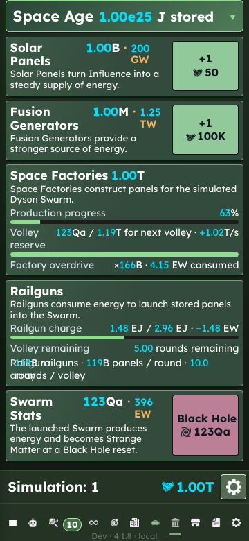
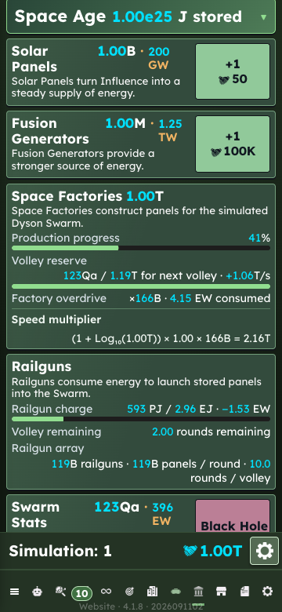

# Simulation screen verification — 13 September 2026

## Behavior and ownership

Simulation's Buy 1/10/50/100/Max selection now uses `dream.set-buy-mode`,
the canonical snapshot, and the same numeric save encoding used by Bots and
Research. The portable field is `simulationBuyMode`. A missing field means
Buy 1 without modifying untouched legacy save shapes. Simulation resets retain
the preference. Formula visibility keeps its existing device-local setting.

Space Factories uses the existing localized Speed multiplier label and
logarithmic formula template. Canonical count, global multiplier, overdrive,
and effective progress per second supply its operands. A full panel reservoir
shows the existing localized Capped label. Production calculations are unchanged.

Simulation progress and formula rows wrap the label/value pair when space is
insufficient. Shared card and quantity-label fitting changes from PR #194 are
retained. The branch was integrated with main at `62842fcd`, including the
Android inset correction from PR #196.

Shared integration files include `ReadyDysonSlice.tsx`, canonical command and
snapshot plumbing, game-state types/mapping, the transitional-checkpoint
current-only field list, and the player dispatcher. The additions in these files
are specific to Simulation's buy mode.

## Review

Reviewed command admission, unchanged/invalid selection handling, save encoding
and defaults, snapshot publication, Simulation reset behavior, canonical formula
operands, and wrapping/overflow. No blocking gameplay or persistence defect was
found. Review strengthened an overdrive test: sustainable energy production,
rather than merely stored energy, must activate overdrive. Both active and
inactive multiplier cases are asserted explicitly.

## Validation

The final CI-equivalent test run (`npm test -- --maxWorkers=1`) passed all
1,584 tests in 158 files. Build/typecheck, lint, gameplay data checks,
localization extraction/compilation, Electron boundary checks and the Android
debug build passed. Generated localization files remained unchanged.
An initial parallel run hit the existing packaging-test and lazy-route-test
time limits while builds/emulator startup ran concurrently; the single-worker
rerun used unchanged timeouts and passed.

- Automated tests cover all five quantities through actual UI purchase commands
  for Hunters, Gatherers, Solar and Fusion; spending/ownership changes;
  checkpoint/reload; portable saves; invalid and missing preferences; command
  idempotence/rejection; automatic Simulation resets; formula visibility;
  and active/overdrive/capped factory facts.
- Production browser visual checks cover 320×720, 360×780 at 130% text,
  393×852, 852×393 at 130%, 768×1024, 1024×768 at 130%, and 1440×1000
  at both 100% and 200%. English, German, and expanded en-XA were checked.
- The browser purchase/reload check explicitly selects the visible Buy 100
  label, purchases Hunters, waits for the normal checkpoint, reloads, and
  verifies the selection, formula toggle and ownership. The disposable browser's
  existing writer-handoff prompt is handled only within that test profile.
- Android validation uses a disposable Pixel 7/API 35 emulator and the actual
  debug APK, including persisted selection/ownership, portrait and landscape
  with enlarged text, and an in-place debug update. No connected physical
  device or user save was used.
- iOS Simulator and physical-device validation remain separate. This is not
  complete accessibility certification. Long translated era headings and some
  card/action text still have independent clipping cases outside these rows.

All browser launchers used an isolated profile and `--use-mock-keychain`.
Screenshots use synthetic state; no player save or private Discord material is
included.

## Visual evidence

The original reproduction below is from `d4b6fd54`, before this implementation.
The final capture includes the newer main integration described above; unrelated
header/button differences are not attributed to the progress-row fix.

