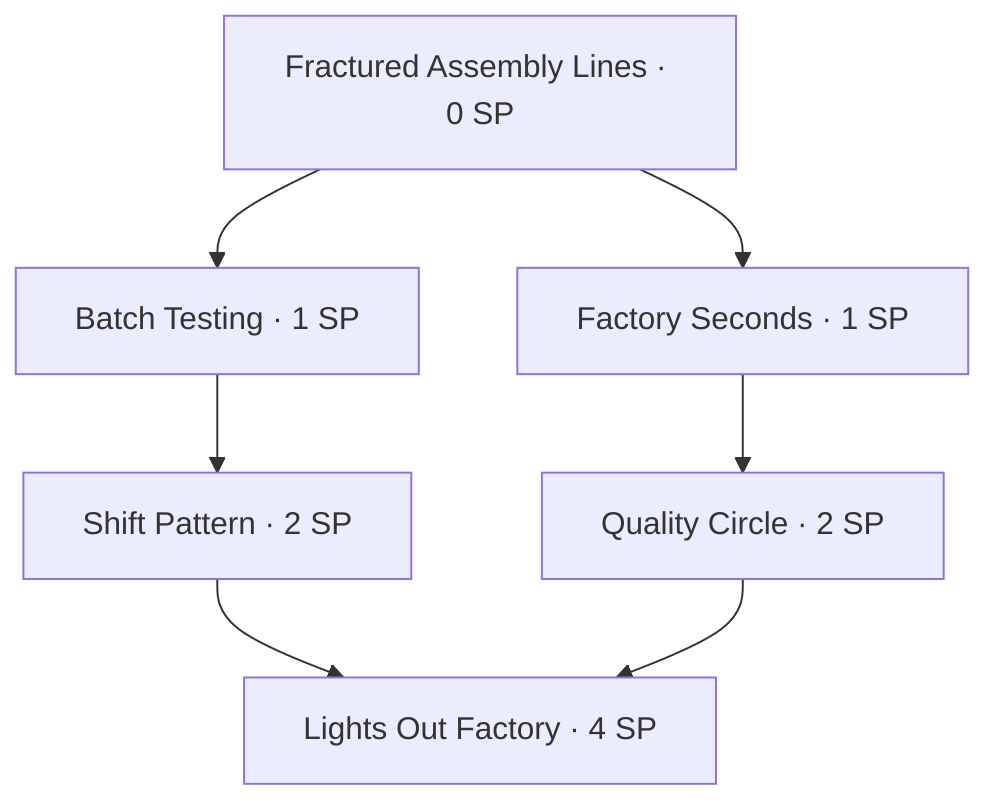
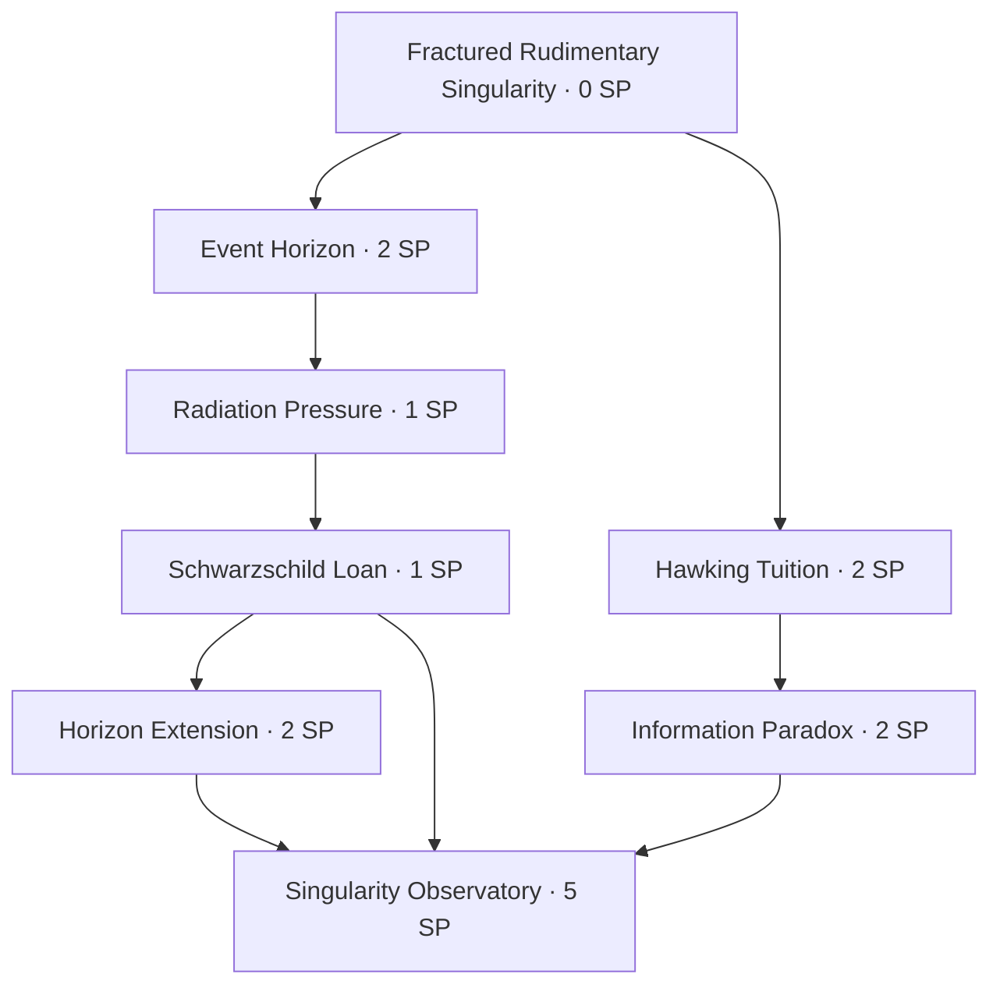
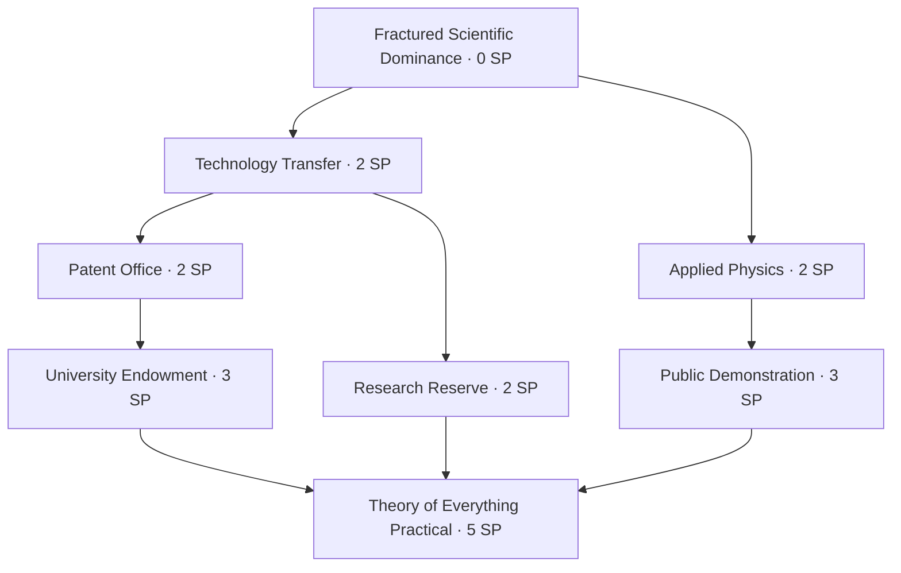
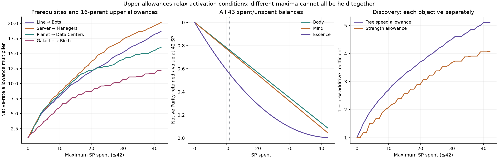

# Branch patterns and the 42-SP budget

**Revision 2 · 30 September 2026 · proposal only.**

The [485-choice catalogue](complete-skill-augment-catalog.md) uses the game’s existing small alternative menus, inexpensive cumulative ladders and expensive shared-prerequisite specializations. Every menu gets a parent-specific rationale and exact entry costs. This appendix explains the topology and what a legal loadout can actually buy.

## Existing patterns inspected

| Current parent | Choices | Node SP | Entire menu SP | Deepest entry SP | Max depth |
| --- | ---: | --- | ---: | ---: | ---: |
| Manual Labour | 11 | 1–1 | 11 | 7 | 7 |
| Mega Swarm | 2 | 1–3 | 4 | 3 | 1 |
| Production Scaling | 2 | 3–3 | 6 | 3 | 1 |
| Cash & Science | 3 | 1–1 | 3 | 1 | 1 |
| Super-Radiant Scattering | 7 | 1–5 | 16 | 12 | 3 |
| Super Swarm | 3 | 1–3 | 7 | 3 | 1 |
| Ultimate Swarm | 3 | 3–5 | 12 | 5 | 1 |

Manual Labour’s facility ladder increases what Tinker can build without replacing earlier yields. SRS combines entry choices with all-of prerequisite joins, and its 12-SP Stellar Memory path does not require buying the entire 16-SP menu. The Swarm menus use cost to separate convenience, compound scaling and broader automation. The new proposal preserves these seven branches.

The 97 empty parents receive 4 three-choice, 27 four-choice, 37 five-choice, 23 six-choice and 6 seven-choice menus. This is exactly **485/97 = 5 choices per parent**. Broad parents carry more functional paths; limited lifetime or banking modifiers carry fewer. No new menu exceeds seven choices even though the existing Manual Labour menu has eleven.

## Representative branch structures

### Assembly Lines: two routes join at a capstone



Lights Out Factory needs both routes. Its entry cost is **1 + 2 + 1 + 2 + 4 = 10 SP**, leaving 32 points for other ordinary skills or augments. The factory/Tinker route can be bought by itself for three points; the paid-purchase/panel route also costs three. The capstone commits to education and industrial output rather than granting another unrelated entry bonus.

### Rudimentary Singularity: a cheap cumulative path



The SRS facility-strength path costs six points including its ancestors. The Observatory joins the physical/loan route with the Black Hole/reward route and costs fifteen points in total. This is the only depth-five new branch. It preserves Rudimentary’s existing nonlinear formula and changes bounded source strength instead of its exponent.

### Scientific Dominance: expensive commitment across three specializations



The shared Technology Transfer ancestor is paid once. The complete capstone closure costs **19 SP**, not the sum of three separately computed entry costs; 23 SP remain. Taking only the economic or Fusion path is an intentional alternative to that large commitment.

## Cost and reachability checks

| Node cost | New nodes |
| ---: | ---: |
| 1 SP | 79 |
| 2 SP | 240 |
| 3 SP | 87 |
| 4 SP | 53 |
| 5 SP | 26 |

There are 200 entry nodes, 180 at depth two, 81 at depth three, 23 at depth four and one at depth five. All dependencies stay within their parent’s menu, all graphs are acyclic and all 485 nodes have a full closure costing at most 19 SP. Every individual proposal is reachable within 42 SP, while many capstones cannot be taken together.

The entire set of menus costs 1,162 SP. That figure describes catalogue breadth, not a player’s balance state. An exact node-count optimization over sixteen used parents and 42 SP finds a maximum of **34 new nodes**. The 128 sampled closed selections owned 17–26, averaging 20.414 nodes. Native ordinary skills and the existing 31 augments consume the same points and usually reduce that count further.

A Fractured parent costs 0 SP but still consumes a Catalyst. Several new choices under one parent consume one Catalyst together. A required functional donor—such as SRS, Scientific Planets or Planet Assembly—must exist; the Fracture does not create it. The budget optimizer deliberately omits ordinary donor costs and relaxes activation conditions to produce conservative ceilings, not recommended builds.

A fresh Infinity starts at 32 SP. The numerical harness pays **whole node costs** only when the required nodes are owned and enough points exist. It later spends ten goal points. No partially reserved fraction of a node earns an effect.

## Exact finite-cap frontiers

For each parent, enumerate every subset of its menu and reject subsets missing a prerequisite. There are **1,060 local closed subsets**, including the empty subset for each parent. For every target channel, combine those choices with a finite knapsack over SP `0…42` and used parents `0…16`.

```text
DP[p,c,k] = greatest allowance after p menus, c SP and k used parents
DP[p,c,k] = max over legal local subsets A:
            DP[p-1,c-cost(A),k-(A is nonempty)] + allowance(A)
```

This exactly optimizes the declared finite allowances under the DAG and budget. Conditions such as warm-up, waiting, current progress, opposing allocation and unspent SP are relaxed. Finite stock gifts, progress packets and raw generator bridges have different units and are not smuggled into these rate coefficients. Shared price, SRS and Strange Matter ceilings apply after accumulation. A capstone replacing an earlier coefficient counts only its incremental change.

| Source channel | New coefficient allowance | Native-source ceiling | Witness SP / parents |
| --- | ---: | ---: | --- |
| Assembly Lines → Bots | 17.690 | 18.690× | 42 / 13 |
| AI Managers → Lines | 16.523 | 17.523× | 42 / 12 |
| Servers → Managers | 19.157 | 20.157× | 42 / 14 |
| Data Centers → Servers | 15.390 | 16.390× | 41 / 13 |
| Planets → Data Centers | 14.990 | 15.990× | 42 / 9 |
| Matrioshka → Planets | 10.690 | 11.690× | 42 / 8 |
| Birch → Matrioshka | 10.690 | 11.690× | 42 / 8 |
| Galactic → Birch | 11.190 | 12.190× | 41 / 10 |
| Cash | 17.350 | 18.350× | 42 / 14 |
| Science | 13.550 | 14.550× | 41 / 14 |
| Education | 15.550 | 16.550× | 41 / 16 |
| Panels | 14.500 | 15.500× | 42 / 9 |
| Panel Lifetime | 9.000 | 10.000× | 42 / 6 |

The largest ordinary-link factor is **20.157×**, not an unbounded product of 485 multipliers. Each row is a separate optimization; their witness selections are different. Their product is a conservative Cartesian envelope, not a legal simultaneous loadout. Native nonlinear coefficients also change during progression, so these fixed-source frontiers are not a whole-game Bot ceiling.

All four phases have separate machine-readable frontiers and closure-checked witness IDs. Discovery’s largest new shared speed coefficient is 4.11, while strength is 3.08; maximizing both together is not established. Later shared speed is weighted by ½ and ¼, and final tier-specific bonuses are counted once.



## Purity pays its real opportunity cost

The native formulas are:

```text
Body(S) = 1 + 0.25S
Mind(S) = 1 + 0.50S
Essence(S) = 1 + 0.42S + aS(S-1)
a = (255 - 0.42×42)/(42×41)
S = actual unspent SP, not the original budget or a refunded virtual balance
```

Essence is quadratic, not exponential. It reaches exactly 256× at 42 unspent points. The complete 43-point curves were evaluated through the native owners; all 24 dependency-closed selections across the three new Purity menus were enumerated with their actual remaining SP.

| Purchase choice | Spent / unspent | Native parent value before → after | New role |
| --- | --- | --- | --- |
| Resting Hands alone | 1 / 41 | Body 11.5× → 11.25× | +80% Factory output at this balance; off-chain convenience. |
| Full Body menu | 8 / 34 | Body 11.5× → 9.5× | Waiting Factory output, occasional bounded Tinker and launch Energy pricing. |
| Full Mind menu | 8 / 34 | Mind 22× → 18× | +68% slowest-subject education, research/Discovery and Simulation pricing options. |
| Clear Horizon path | 3 / 39 | Essence 256× → 221.658× | +100% ordinary mega output, separate from the five native Essence facility targets. |
| Full Essence / Inner Universe path | 11 / 31 | Essence 256× → 142.211× | +150% education/Factories, +100% mega output, +31% research/Strange Matter and +15.5% later strength. |

The full Essence path retains **55.55%** of the parent’s native multiplier. At a fixed state, its five basic links would retain roughly `(142.211/256)^5` of the old chain prefactor before its separate mega and research benefits. It cannot be labelled a free or automatically dominant upgrade. If Body or Mind are also owned, their losses must be included too. Further purchases may disable the 20- or 24-unspent-point conditions.

The table maximizes non-SP conditions such as waiting. Occasional Tinker and a quiet-time bonus cannot both stay at their maximum continuously. Phase-specific effects are alternatives, not research and Discovery benefits awarded together.

## Fragment classification within a legal budget

Seven base Fragments plus the two existing Production Scaling augments give `F≤9`, retaining a purchase threshold of at least 50. New proposals do not inherit a Fragment tag from their parent.

The counterfactual optimizer can select nineteen new nodes on the six newly augmented Fragment parents for **34 SP**, plus six SP for the existing two Fragment augments. With the seven base Fragments available, this legal 40-SP allocation would yield **F=28**, making `90−5(F−1)` negative and clamping the Compound denominator to one. This comparison respects the 42-SP limit; it does not assume every proposed node is owned.

The complete purchase curves in the [mathematical appendix](complete-skill-augment-math.md#purchases-and-fragments) show why preserving tags is required. The corresponding witness list is saved in `revision-2/branch-frontiers.json` in the analysis bundle.

## Refund and respec rules

A prerequisite refund atomically removes purchased descendants, returns each cost once and leaves independent routes assigned. Already consumed coupons, natural-source identities, absence IDs, threshold flags and absolute cooldowns do not refill. Assignment-gated charge pauses when unassigned; waiting clocks continue to measure the actual native event time. Commitment Issues retains its native restrictions.

The instantaneous 42-SP constraint does not limit benefits accumulated through historical respecs. Those need durable flags, finite buckets, qualified ending-stock retentions and deduplicated external events. The [catalogue](complete-skill-augment-catalog.md) specifies the reset boundary for each new ledger; the [math appendix](complete-skill-augment-math.md) supplies the source bounds.
