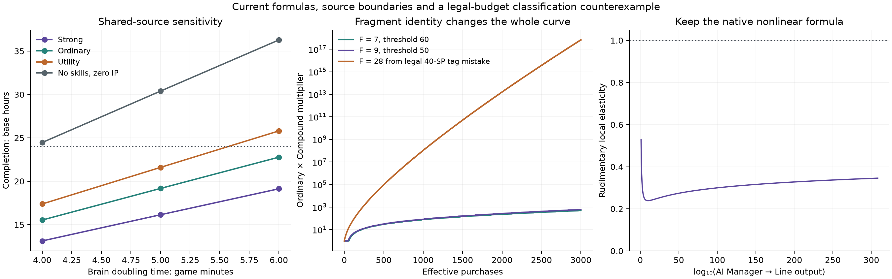

# Mathematical and numerical balance study

**Revision 2 · 30 September 2026 · proposal calibration, not implemented gameplay.**

This accompanies the [485-choice catalogue](complete-skill-augment-catalog.md), [branch analysis](complete-skill-augment-branches.md) and [main recommendation](complete-skill-augments.md). It separates current formulas, analytical boundaries, full canonical-engine sweeps, component projections and work that still requires actual integration.

## Scope and units

The target is approximately one day after all nine challenges, with at most sixteen Fractured parents, 42 ordinary SP and some genuine idle time. A fresh Infinity has 32 points before earning ten goal points. No paid entitlement is used.

Game time includes Double Time once. Base time is processed active or Stored Time; elapsed time also includes real absence. The current Reality caller uses game time, despite a contradictory helper comment. Absence credits a bank; it does not simultaneously advance production. Device time processing that bank is additional.

The numerical preparation is synthetic and disclosed: 19 Divisions, 27 Secrets, 100 Quantum Cash and Science levels, permanent SP systems, all challenge completions, late unlocks and Double Time. This is a prepared cap push, not a timed account history. Ordinary facility/research automation is on; automatic Infinity is off during a push.

“Any combination” requires a progressing policy. Repeatedly resetting, never acquiring a Galactic Brain, or never spending Stored Time can prevent completion indefinitely. This study supplies a route and calibration for broad choices, not an unconditional deadline under every action policy.

## Current mathematical structure

### Eight-stage production chain

With one fixed Galactic Brain and constant downstream coefficients, the leading Bot term is polynomial of degree eight:

```text
B(t) ~ G0 × product(k_i) × t^8 / 8!
```

Purchases, research, IP, panels, Stellar creation, Pocket Dimensions and Rudimentary change these coefficients. This isolated chain nevertheless explains why a few 2× utility bonuses cannot reliably bridge `4 × 10^242` Bots.

| Producer → output | Base output per game second |
| --- | ---: |
| Assembly Line → Bots | 1/10 |
| AI Manager → Lines | 1/60 |
| Server → Managers | 1/600 |
| Data Center → Servers | 1/900 |
| Planet → Data Centers | 1/3600 |
| Matrioshka Brain → Planets | 1/7200 |
| Birch Planet → Matrioshka Brains | 1/14400 |
| Galactic Brain → Birch Planets | 1/28800 |

The engine retains some compatibility float casts. Models use runtime rates and current [facility balance](../../src/game-data/facilityBalance.ts), rather than frozen Unity definitions alone.

### Purchases and Fragments

For effective paid/virtual purchase count `N`, explicit active Fragment count `F` and Swarm rate `r`:

```text
r = .01, .02, .03 or .05
K = max(0,90-5(F-1))            with Production Scaling; otherwise100
L(N) = 1 + r×max(0,N-K)
C(N) = (1+r)^floor((N/max(1,K))^.825)       with Compound Fragments
P(N) = L(N)×C(N)
StellarSwarm = 1 + log_base12.5(P(N))×log_base12.5(max(1,Bots))
```

The ordinary layer is linear beyond its threshold. Compound is separate; the approved logarithmic Stellar Swarm expression must not become a Bot-valued exponent. Only seven base Fragments and two current augments count, so `F≤9` and `K≥50` in this proposal.

The rejected classification is a **legal budget counterexample**: nineteen hypothetical newly tagged nodes cost 34 SP, plus six for the existing two Fragment augments. With seven base Fragments, `F=28` collapses `K` to zero. It does not assume all 485 choices are owned. The new nodes stay outside the Fragment classification.

| Effective purchases | F=2 | F=7 | F=9 | F=28, rejected |
| ---: | ---: | ---: | ---: | ---: |
| 0 | 1× | 1× | 1× | 1× |
| 10 | 1× | 1× | 1× | 2.01× |
| 40 | 1× | 1× | 1× | 7.96× |
| 50 | 1× | 1× | 1.05× | 11.9× |
| 69 | 1× | 1.52× | 2.05× | 21.2× |
| 90 | 1.31× | 2.62× | 3.15× | 38.7× |
| 100 | 1.84× | 3.15× | 3.68× | 51.3× |
| 300 | 13× | 15× | 16.4× | 3.43e+03× |
| 1000 | 65.8× | 78.2× | 83× | 1.05e+08× |
| 3000 | 353× | 501× | 611× | 6.56e+17× |

The plotted curves include the Compound integer steps across the entire displayed range, not just these table points.

### Native nonlinear feedback

Rudimentary reads `X`, the AI Manager output that creates Lines:

```text
R(X) = (log2 X)^(1 + log10(X)/10), X>1
u = ln X
eta(X) = d ln R / d ln X
       = ln(u/ln2)/(10 ln10) + 1/u + 1/(10 ln10)
```

For `10≤X≤Number.MAX_VALUE`, the unmodified local elasticity is below approximately .53 and about .346 at the upper endpoint. The activation region `1<X<10` lies outside that bound. Cluster Networking and other factors are separate. The current English description omits the actual `1 + …/10` exponent; the model follows the code.

This is pre-existing feedback through the lower chain. A simplified local equation `alpha=lambda+eta×alpha` suggests `alpha≈lambda/(1-eta)`, but it is not an exact model of every link, purchase or research interaction. An isolated eigenvalue is not the whole game’s growth rate.

New direct output modifiers have finite caps and leave the native exponent intact. Raw upward bridges do not copy aggregate populations: Pocket Outposts uses `.05×log10(Workers)` before all Pocket modifiers; Moon Nursery uses `.02×log2(Planets)` and needs actual Planet Assembly plus the Matrioshka unlock. In finite double range their donors are bounded by roughly 15.413 Planets/s and 20.48 Matrioshka/s. Cross Talk uses the actual per-Planet Pocket intermediate, including native modifiers, so it does **not** have the smaller unmodified-log bound; it excludes owned-Planet multiplication and new packet feedback. Its new Scientific Planet source never feeds Shoulders accrual. Parallel Tenants is a downward raw source, and Colony Workshops uses only `.25×native Fragment count` as a downward Data Center source.



## Convergence supplies the common route

The proposed homogeneous source is:

```text
dG/dt = lambda×G + native Galactic Brain creation
lambda = ln2/300 = .0023104906018664843 per game second
```

At fixed coefficients the system is triangular, with eigenvalues `lambda,0,…,0`. It is finite at every finite time. For one initial Brain, eight constant links and no other initial stocks:

```text
B(t) = G0×product(k_i)/lambda^8
       ×[exp(lambda×t)-sum(j=0…7)((lambda×t)^j/j!)]
```

This proves the new source’s isolated growth law. It does not include Stellar Bot debits, price/research dynamics or establish a whole-game exponent.

A conservative coefficient illustration keeps 27-Secret multipliers on Lines, Managers, Servers and Planets, applies `/3` to the Data Center link and `/8` to the Planet link, and omits IP/research/positive ordinary skill modifiers. Its prefactor is **0.0649619**, giving **33.744 base hours after the first Brain** with Double Time. Native purchases and positive interactions explain the faster measured runs. This is not a universal completion-time proof.

Replicate `G_start×expm1(lambda×gameSeconds)` as a distinct generated source. It cannot be modified by ordinary output, SRS, IP, Avocato, Discovery or Tinker. Newly created Brains begin contributing the new replication on the next interval in the external model; cadence comparisons quantify this operator ordering. Retain real Stellar Bot debits.

### Doubling-interval sensitivity

| Reference | 4 game minutes | **5 game minutes** | 6 game minutes |
| --- | ---: | ---: | ---: |
| Strong | 13.13 h | **16.14 h** | 19.13 h |
| Ordinary | 15.53 h | **19.18 h** | 22.78 h |
| Utility | 17.38 h | **21.60 h** | 25.80 h |
| No skills, zero IP | 24.47 h | **30.39 h** | 36.28 h |

These use 30-second Stored Time steps and the disclosed preparation. The no-skill reference has no Fractures assigned and Avocato ×1. Five minutes is the proposed compromise, with about-day weak allocations and room for stronger choices or active play to matter.

## Budget-constrained bounds on new effects

The machine-readable catalogue gives every node a typed, phase-specific balance annotation. Rate/enhancement/quote coefficients have dimensionless units; recurring production packets record at most native production seconds per game second. Finite gifts, retention, raw-source bridges and conserved action variants keep their own quantity limits.

There are 1,060 dependency-closed local subsets over 97 menus. A finite knapsack over 0–42 SP and 0–16 used parents yields the [complete per-stat frontiers](complete-skill-augment-branches.md#exact-finite-cap-frontiers), with reconstructable legal purchase witnesses. Activation conditions and some target eligibility are relaxed to make these upper allowances. Native donor purchases and the existing 31 augments are omitted from the optimizer; in real builds they consume the same SP.

| Source channel | New coefficient allowance | Native-source ceiling | Witness SP / parents |
| --- | ---: | ---: | --- |
| Assembly Lines → Bots | 17.690 | 18.690× | 42 / 13 |
| AI Managers → Lines | 16.523 | 17.523× | 42 / 12 |
| Servers → Managers | 19.157 | 20.157× | 42 / 14 |
| Data Centers → Servers | 15.390 | 16.390× | 41 / 13 |
| Planets → Data Centers | 14.990 | 15.990× | 42 / 9 |
| Matrioshka → Planets | 10.690 | 11.690× | 42 / 8 |
| Birch → Matrioshka | 10.690 | 11.690× | 42 / 8 |
| Galactic → Birch | 11.190 | 12.190× | 41 / 10 |
| Cash | 17.350 | 18.350× | 42 / 14 |
| Science | 13.550 | 14.550× | 41 / 14 |
| Education | 15.550 | 16.550× | 41 / 16 |
| Panels | 14.500 | 15.500× | 42 / 9 |
| Panel Lifetime | 9.000 | 10.000× | 42 / 6 |

Each row is optimized independently. Multiplying all eight ordinary-link ceilings gives **2.882 × 10^9**, although no legal loadout necessarily achieves them together. In the fixed linear core this only changes asymptotic Double Time completion by **1.309 base hours**, because:

```text
Delta t_base = ln(product of coefficient ratios)/(2×lambda)
```

It is a Cartesian coefficient envelope, not a whole-game time bound. Research, price, lifetime, SRS and raw generators remain additional mechanisms and are examined separately below.

As a second loose audit check, every declared new direct coefficient satisfies `b_a≤2×cost_a`. Thus 42 spent points give `sum b_a≤84` for one channel, or at most 85× its fixed native source. The exact menu frontiers are far smaller. A prior 85×-on-every-source engine stress proxy completed in 14.042 h strong, 19.458 h utility and 27.933 h with no skills; it is intentionally unattainable and is not a substitute for integrating the new mechanics.

### Native price growth and quote offsets

For a native quote `Q0×q^N` and combined new amount discount `d≤.5`:

```text
Q_new(N) = (1-d)×Q_native(N)
Equivalent quote-index shift = -ln(1-d)/ln(q)
```

At the smallest ordinary facility growth with nine Reductive Scaling Fragments, `q=1.21-.005×9=1.165`, a 50% amount discount shifts the quote by at most **4.539 indices**. With Supply Shortage’s `q=2`, the shift is one index. Challenge and native Terra/Swarm overrides remain authoritative.

All percentage discounts, flat quote reductions, coupons and Cash-funded vouchers must be combined against one quote and clamped together; no sequential reduction evades 50%. Represented native debits, discrete rounding and minimum-input rules still apply. No exponent, paid index, SP/Catalyst/QS/TP price is reduced.

Soft Landing is an explicitly finite input entitlement after an actually rewarded Black Hole: it funds the one Factory input, while the full Rocket input remains payable. It is a stock-funded gift exception, not another recurring percentage discount. The entitlement cannot stack.

### Recurring grants and event provenance

A token bucket with capacity `C` and refill `rho` permits at most `C+rho×T` native production seconds over duration `T`. Starting empty gives the tighter initial bound `rho×T`. Refunds do not refill it. Grant quantities quote native production before **all new bonuses and packets**, so combined additions cannot quote one another.

Cooldown grants have an explicit first-event boundary term. Factory Seconds’ one-second grant every two game seconds, for example, is at most `1+T/2`; claiming exactly `T/2` at every interval endpoint would be too strong. The dimensionless .5 allowance is its recurring slope, while the finite boundary packet is separate.

First-purchase, warm-up, paid threshold, subject and reset gifts use finite flags. Actual Cash spent requires a positive represented debit. Lawful zero-Cash manual purchases, including Deferred Billing, can satisfy native ownership milestones but do not fund Cash-spent rebates. Generated or retained units do not count as paid units, virtual threshold counts do not earn paid rewards, and assignment does not reconstruct historical transactions.

For a Discovery-tier reward source, define an intrinsic ledger `L_i`, incremented only by that bar’s directly time-earned progress:

```text
L_i added = integral(own final speed_i × gameSeconds)
qualified source events ≤ floor((L_i_initial + L_i_added)/barRequirement_i)
bar requirements = 3600,1800,600 raw progress units
```

A real completion qualifies only when a full-bar intrinsic credit is available; consume that shared credit once and assign one event ID. Incoming native transfers and new packets add no intrinsic credit. Assigned augments may each respond once to that event. A grant-completed bar therefore cannot become another source on the next update just because the next update happens in the native owner. This prevents indirect callback/reassignment loops as well as immediate recursion.

The native higher-tier cascade still awards its own native lower-bar progress and completions. New augments simply use the stricter source qualification for their extra rewards. Fixed raw packets are not multiplied again by current speed or converted into paid upgrades.

### SRS charging and source enhancements

The source has no Scatter action or charge maximum. The five native SRS facility targets are the basic chain; Cash/Science have separate terms. New charging is:

```text
Cprime_new = Cprime_native + min(1,sum(new charging coefficients))
```

The extra coefficient is against the base one-second-per-game-second rate, not against Deep Exposure, Research Conversion, Research Activity or Stellar Memory. At full native activity with Memory multiplier `M`, the rate is `1+4.5M`, becoming at most `2+4.5M`. At `M=1`, that is **5.5 → 6.5**, not eleven. SRS’s new Cash and basic-facility enhancements apply once to their bonus above one; the present catalogue reaches +25% in each, with +100% shared ceilings reserved as safety limits.

Twelve component projections used actual native SRS owners at three banked-charge values and four durations. At 24 base hours/172,800 game seconds, zero initial bank and a 1,800-second starting charge, the full-activity totals were **952,200 native charge seconds** and **1,125,000 projected**, a **1.18147×** ratio. Hot Start was excluded from earned Stellar Memory charge.

A separate canonical-engine source projection paid an exact legal 42-SP build: sixteen SP for the complete native SRS menu, twenty-six for the new charging/Cash/facility paths, sixteen Fractures. It maximized those paths’ activation conditions, left every other proposed effect withheld, and injected only the three real SRS changes externally:

| Preparation | Effects withheld | Upper-condition SRS projection |
| --- | ---: | ---: |
| 1,000 IP, Avocato ×27 | 19.958 h | 19.808 h |
| 42 IP, Avocato ×1 | 23.083 h | 22.925 h |

This is a focused projection with real SP paid and native SRS dynamics. It is not runtime integration of all named new nodes, their timers, persistence or conditions. The fixed Convergence rate is untouched.

New Frozen Charge and Webb Archive restore only real ending charge, up to 60/120 seconds, by maximum against the **complete** native Hot Start/Afterglow result. Retained or granted charge never becomes new Memory-earned charge or assignment-time reward progress.

### Discovery tiers and persistent investment

The new shared tree-speed allowance is at most 4.11 in Discovery and 4.10 in later variants; weights remain 1, ½, ¼. Final tier-specific allowances reach .40 for Elevation and .71 for Enlightenment, separately optimized. New shared strength enhancement is at most 3.08, added to the native enhancement on the bonus above one. These maxima cannot all be held together.

Eighteen pure component projections use the actual `advanceDiscovery` owner: three available-tier phases, speed/strength-optimized legal SP subsets and 0/100/1,000 persistent power purchases. They use a source-isolated baseline speed of one and zero existing enhancement, so they study the new coefficients and cascade rather than make whole-game pace claims. Existing free parent effects are deliberately not credited in this component comparison.

At zero persistent power and 24 processed base hours, the speed objective produced 245/989/2,501 Discovery completions with one/two/three tiers, versus 48/96/144 in its component controls. The three-tier difference shows the product of faster higher-tier transfers and faster lower-tier bars; a single 5× speed number would understate that cascade. With fixed finite speeds, however, each highest-tier count is linear in time, then feeds finite linear lower-tier counts. This does not introduce an infinite event cascade. New progress packets are omitted from this component study and still require the intrinsic-source ledger above.

Power purchases retain their full native TP prices. Higher initial power raises the native strength, then the bounded new enhancement acts on that larger existing bonus. High-persistent-investment cases therefore matter even though the new coefficients are capped. The component output records every tier, speed, strength and progression state for all eighteen cases.

### Complete Purity opportunity cost

All 43 spent/unspent balances and 24 closed new-menu selections are evaluated in the [branch appendix](complete-skill-augment-branches.md#purity-pays-its-real-opportunity-cost). Native Essence is quadratic:

```text
Essence(S) = 1+.42S+((255-.42×42)/(42×41))×S(S-1)
```

The full Inner Universe closure costs 11 SP and leaves 31: native Essence falls 256×→142.211×. Its claimed off-chain benefits use 31 actual unspent points—31% research/Strange Matter and 15.5% later strength, not the cap values advertised for larger reserves. Additional purchases may disable the 24-SP condition. No new effect treats purchased prerequisites as still-unspent points.

### Retention and cross-system resource boundaries

| Mechanism | Quantity boundary |
| --- | --- |
| Cash/Science retention | Minimum of actual ending balance, stated native income duration and fixed currency ceiling. |
| Facility/machine retention | Minimum of real source-qualified ending units and stated small count; maximum with competing retentions. |
| Research retention | Separate paid/generated provenance; next price follows final retained total. No invented old-source attribution. |
| Warm-up/SRS retention | Maximum of eligible final entitlements; actual ending charge/time and explicit timer ceiling. |
| Unlaunched panels | One entitlement against original unrewarded stock, shared 30% ceiling. |
| Strange Matter | Sum against actual positive native Black Hole reward, shared +100%, no reward-on-reward. |
| Education sharing | Directly time-earned source only, no copy of another transfer or completed subject. |
| Railgun capacity/partial volleys | Quote final payload, conservatively debit real Energy and unlaunched panels, retain shot timing/state. |
| Stored Time overflow | Actual accepted/rejected real absence interval and deduplicated external event ID, not doubled bank units. |
| Convergence/Tinker | New copies and grant packets never inflate native funded Stellar creation caps. |

These bounds prevent duplication and new unbounded exponent/price layers. They do not constitute a theorem bounding the complete existing nonlinear game or every implementation bug.

## Canonical-engine experiment design

The harness imports the actual canonical application/runtime, resets through `applyCanonicalInfinityReset`, and uses native `advanceGame`, transactions, derivation, automation, Tinker and away-time settlement. Only Convergence is added in the broad sweeps. Old fixture stocks, 30 purchased units and precharged SRS are not inherited accidentally.

Every snapshot audits actual purchased costs, unspent SP and external blueprint costs against the earned budget. Proposed ownership stays outside native asset definitions, avoiding unknown definitions or free accidental native effects. Whole nodes require their full cost and prerequisite ownership. All 128 new plans spend exactly 42 SP by cap completion.

Avocato inputs are generated from actual feed quantities and asserted with `avocadoDysonMultiplier`: each food receives `10^cuberoot(M)` for requested multiplier `M`. The true ×1 threshold is used. An earlier exploratory ×1 setup actually gave ×9; affected final inputs were rerun before the reported evidence.

### Build samplers and results

Seed 20260930 sampled 256 distinct sixteen-parent sets uniformly without replacement within each set. Purchase priorities independently shuffled 104 base IDs and 31 existing augment IDs, then the actual canonical transaction owner enforced affordability, prerequisites and exclusions. Half use 1,000 IP/Avocato×27 and half 42 IP/true ×1.

Seed 2026093003 sampled 128 sets of sixteen parents from the 97 covered parents. Closed proposed selections cost 42 SP; all effects are withheld. Final owned counts range 17–26. The 40/42-point intrinsic component witnesses and the 42-point SRS projection are separate targeted evidence.

| Selection and preparation | Builds | Median | Slowest | Within 24 h | Reached cap |
| --- | ---: | ---: | ---: | ---: | ---: |
| Current skills/augments; 1,000 IP, Avocato ×27 | 128 | 19.43 h | 26.54 h | 124 | 128 |
| Current skills/augments; 42 IP, Avocato ×1 | 128 | 22.53 h | 30.28 h | 83 | 128 |
| New branch DAG, effects withheld; 1,000 IP, Avocato ×27 | 64 | 24.20 h | 24.83 h | 15 | 64 |
| New branch DAG, effects withheld; 42 IP, Avocato ×1 | 64 | 27.48 h | 27.99 h | 0 | 64 |

All 384 reached the cap within 31 hours at sweep cadence. Thirty-two paired mature controls without Convergence reached no cap within 36 hours. At 24 hours their `log10(Bots)` ranged 87.906–123.877, median 113.888, against the 242.602 target. These controls do not rule out optimized current strategies outside the sampled policy.

There are `C(104,16)=2,653,828,761,561,014,310` parent sets before spending SP. Samples are not exhaustive. For the two 128-build current-skill samplers, zero failures gives a one-sided 95% upper bound of `1-.05^(1/256)≈1.163%` on their equally weighted mean failure probability under the stated sampling/preparation/policy assumptions. It is not a guarantee about adversarial selections, the separate new-only sampler or actual unimplemented interactions.

### Cadence, Tinker and idle profiles

| Case | Base/elapsed hours | Evidence |
| --- | ---: | --- |
| Strong, 30-second Stored Time | 16.1417 | Broad-sweep cadence. |
| Strong, one-second Stored Time | 16.0281 | 57,701 native updates. |
| Strong, 0.1-second active | 16.0151 | 576,542 native updates. |
| Slowest mature sample, one-second | 26.4378 | Coarse value 26.5417. |
| Slowest lower-preparation sample, one-second | 30.3958 | Coarse value 30.2833; error can go either direction. |
| No skills/zero IP, one-second | 30.2089 | Coarse value 30.3917. |
| Same Manual Labour, hold/wait/none | 14.2867/16.3586/16.4631 | Native Tinker, not new Tinker augments. |
| Strong Fractures, all 42 SP unspent | 17.8833 | Native Purity tradeoff. |
| Six-hour Infinity farming then push | 20.3417 | Policy comparison, not optimal farming. |
| Strong, four active+eight away+bank | 16.0281 elapsed | Absence credited once, no production while absent. |
| Utility, same schedule | 21.5025 elapsed | One-second active cadence and finite bank replay. |
| Utility with Idle Electric Sheep | 13.5150 elapsed/21.5150 processed | Eight real away hours credit sixteen bank hours. |

The mixed profile has enough bank capacity and divides bank replay into 5,000 intervals. Device processing time is extra; these are policy simulations, not measurements on a phone.

Galactic Tinker must not quote Convergence-created stock as its passive source ceiling. A 2%-of-stock completion every 0.2 game seconds could otherwise add approximate growth `ln(1.02)/.2≈.099/s`, over forty times the proposed replication rate. The native funded-creation source distinction is mandatory, including after new direct bonuses are implemented.

### Current-skill Discovery-phase timing

The same rebuilt permanent preparation, zero purchased power/speed and zero initial bar progress gives:

| Available tiers | Strong | Utility |
| --- | ---: | ---: |
| None | 16.142 h | 21.600 h |
| Discovery | 16.358 h | 21.742 h |
| Discovery + Elevation | 15.883 h | 21.100 h |
| All three | 15.483 h | 20.592 h |

Discovery retires Science and changes skill effects; its first tier is not necessarily faster under every current build. These are prepared-push timings, not the full rebuild after Transcendence. The 121 new Discovery and six later-tier variants are designed and component-bounded, not integrated into these timing rows.

## Confidence and implementation boundary

Established: 104/31 source inventory, all 97 empty parents covered by 485 defined choices, unique IDs/names, valid costs/DAGs, legal32→42-SP traces, exact finite-cap frontiers, complete Purity curves, 384 sampled baseline completions, control/sensitivity/cadence/idle/manual/phase evidence and focused SRS/Discovery projections.

Not established: universal 24-hour completion, an exact finite-time theorem for the whole nonlinear game, all 485 effects integrated and exercised in legal builds, new-effect migration/persistence/localization, or browser/native UI acceptance. Repeat the full matrix and repeated activation, respec, challenge, reset, save/reload and high-persistent-Discovery cases after canonical implementation. Challenge restrictions and resource settlement must apply before any alternate grant; [the main proposal](complete-skill-augments.md#challenges-resets-and-implementation-acceptance) lists each boundary.

The reproducible bundle is `/Users/matthewrushworth/Builds/ids-augment-design-20260930`. `revision-2` contains final catalogues, typed bounds, local subset/frontier witnesses, all 128 new configurations/results, source probes, projection outputs, Purity selections and exportable plots. The original 256 current-skill sweep and fine-cadence outputs remain current evidence. The old uniform two-option proposal and its 64 reserve-only samples are retired and excluded from the 384 count.
