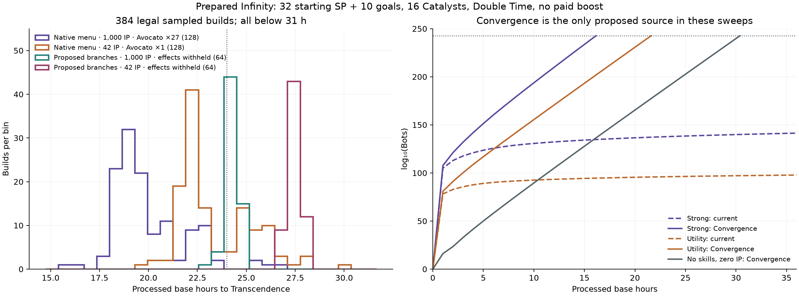

# Complete skill augment proposal

**Revision 2 · 30 September 2026 · design proposal complete; gameplay not implemented.**

This proposal adds **485 augments across all 97 skills that currently have none**. New menus have **3–7 choices, averaging exactly five**, with 1–5 SP costs, alternative paths, cumulative ladders and shared-prerequisite capstones. The seven existing branches and their 31 augments are preserved. Every new entry has concise technical and flavour text, exact prerequisites, full entry cost, formulas, source limits, reset rules and phase-specific behaviour where needed.

The menu is a collection of choices within the same **16-Catalyst and 42-SP limits**. It is not a loadout owning 485 effects. A legal new-only loadout can own at most 34 of these nodes; the 128 sampled new-branch selections owned 17–26. Ordinary skills and the existing augments compete for those same points.

- [All 485 choices, grouped by parent](complete-skill-augment-catalog.md)
- [Branch patterns, prerequisite diagrams and SP tradeoffs](complete-skill-augment-branches.md)
- [Mathematics, full curves and numerical evidence](complete-skill-augment-math.md)
- [All 104 current skills, their descriptions and 31 existing augments](complete-skill-augment-reference.md)
- [Machine-readable catalogue, including typed balance bounds](complete-skill-augment-catalog.json)

## Design based on the existing game

The current branches are deliberately uneven. Manual Labour has eleven inexpensive augments, including a seven-step facility ladder. SRS has seven choices with 1–5 SP prices and shared prerequisites; reaching Stellar Memory costs 12 SP, while buying its entire menu costs 16. The Swarm branches use two or three alternatives with very different costs. Start Here has three independent 1-SP choices. Those are the patterns behind this proposal.

Smaller modifiers receive three or four focused choices. Broad economy, science, quantum, singularity and sacrifice systems receive six or seven. A basic production parent might have one active and one idle entry, two specializations and a capstone joining both. A core nonlinear generator instead gets an inexpensive cumulative path and an independent cross-system route. Each parent’s catalogue section explains its own branch structure; the menus were not expanded by repeating one generic multiplier template.

| New menu size | Parents |
| ---: | ---: |
| 3 | 4 |
| 4 | 27 |
| 5 | 37 |
| 6 | 23 |
| 7 | 6 |
| **Total** | **97 parents, 485 choices** |

Depth ranges from one to five. Individual nodes cost 1–5 SP; the largest complete prerequisite closure costs 19 SP. Shared ancestors cost once when buying several nodes. All new nodes require their Fractured parent, and Fracturing a parent does not remove augment prerequisites. Current canonical refunds already remove dependent purchases; new ledgers must preserve earned entitlements across those refunds.

## The day-long balance target

The target is **“about a day with some idle time”** for a prepared player after completing every challenge, with no paid store boost. A fresh Infinity begins with 32 SP, then earns ten more through goals:

| Source | SP |
| --- | ---: |
| Infinity permanent points | 10 |
| Reality upgrades | 16 |
| Avotation | 4 |
| Banking and Investment from the preceding Infinity | 2 |
| Current-Infinity goals | 10 |
| **Total** | **42** |

Nine challenges award sixteen Catalysts: one each from Blank Slate and Trial and Error, and two from each of the seven Quantum challenges. A Catalyst permanently Fractures one base skill. Its ordinary cost, authored dependency restrictions and downside are removed; functional generators and unlocks still matter. The model never assumes every base skill is Fractured.

Transcendence requires **4 × 10²⁴² Bots**. The present eight-stage chain and nonlinear interactions do not make arbitrary utility allocations reach that threshold in about a day merely by adding small flat bonuses. Thirty-two paired current-game controls did not reach the cap within 36 hours under the sampled policy. This does not rule out better optimized current strategies.

I recommend a separate completion reward, **Convergence**, to supply the common progression route. This is an additional proposed balance change, not an existing rule or a compulsory augment purchase.

## Convergence: a shared challenge-completion reward

> **Technical:** Your Galactic Brains replicate every 5 minutes of game time.
>
> **Flavour:** At last, the universe has learned to delegate.

Unlock from the completion flags of all nine challenges, without granting another Catalyst or SP. One real or legitimately generated Galactic Brain is needed to start. Keep the native facility unlock and purchase rules.

```text
lambda = ln(2) / 300 game seconds
generated copies = G_at_interval_start × expm1(lambda × game_seconds)
```

The route to Bots remains:

```text
Galactic Brains → Birch Planets → Matrioshka Brains → Planets
→ Data Centers → Servers → AI Managers → Assembly Lines → Bots
```

Five minutes means **game time**: Double Time makes this 2.5 minutes of processed base time. IP, Avocato, SRS, purchase bonuses, Discovery, Tinker and new augments cannot multiply this replication rate. Ordinary Galactic Brain output into Birch Planets keeps its existing modifiers.

Copies are generated units, never purchases or coupon sources. They do not supply the Galactic Tinker cap, which must continue to use actual funded Stellar creation. Lawful zero-Bot-cost creation from Fractured Stellar Sacrifices remains a legitimate native source. Distinguish that source from Convergence and new gift packets.

Convergence is suspended during every active challenge. Infinity and Quantum clear its generated Brains normally; the proposed Infinite Altar is an explicit, expensive one-Brain retention exception. A reset during a tick must be detected from the actual reset event, before quoting a new-cycle source. Transcendence retains completed challenges but clears production, so the player must rebuild access to a Brain.

This adds actual Brain production. It does not overwrite Bots with a minimum floor: a Bot floor would accidentally restore Bots spent by Stellar Sacrifices.

## Numerical result

The principal evidence contains **384 sampled builds** using a canonical fresh Infinity reset and the actual engine’s purchases, derivation and automation. The only proposed production mechanic in these sweeps is Convergence.

| Selection and preparation | Builds | Median | Slowest | Within 24 h | Reached cap |
| --- | ---: | ---: | ---: | ---: | ---: |
| Current skills/augments; 1,000 IP, Avocato ×27 | 128 | 19.43 h | 26.54 h | 124 | 128 |
| Current skills/augments; 42 IP, Avocato ×1 | 128 | 22.53 h | 30.28 h | 83 | 128 |
| New branch DAG, effects withheld; 1,000 IP, Avocato ×27 | 64 | 24.20 h | 24.83 h | 15 | 64 |
| New branch DAG, effects withheld; 42 IP, Avocato ×1 | 64 | 27.48 h | 27.99 h | 0 | 64 |

All 384 completed within 31 hours at the 30-second Stored Time cadence; 383 completed within 30 hours. **222/384 completed within a strict 24 hours.** The broad target is about a day, not a universal 24-hour deadline.

The new-branch samples choose sixteen parents from the 97 covered skills, then select dependency-closed purchases totalling exactly 42 SP. The harness buys whole nodes only when affordable from the initial 32 points and later goals. It withholds every proposed effect while still spending the points, so it does not quietly retain Purity bonuses for those spent SP. The observed 23–28-hour band checks whether choosing these branches destroys the common route; it does not certify their unimplemented synergies.

Preparation is deliberately disclosed: 19 Divisions, 27 Secrets, 100 Quantum Cash and Science levels, the permanent SP systems and Double Time. IP and Avocato vary as shown. The study models a prepared push, not the time to earn those permanent systems. Automatic Infinity is disabled during the push; facility and research buying are enabled. Each sampled loadout has at most sixteen Fractures.



A practical tuning target is **18–28 hours**, with weak outliers approaching 31 hours and stronger active builds finishing sooner. Four-game-minute replication compressed the strong reference to 13.13 hours, while six minutes pushed the weakest reference beyond 36 hours. Five minutes is a tunable recommendation rather than an approved implementation value.

### Cadence, Tinker and genuine idle time

The strong reference completed in **16.015 h at 0.1-second active steps**, **16.028 h at one-second Stored Time steps** and **16.142 h at 30-second steps**. The slowest sampled mature and lower-preparation cases became **26.438 h** and **30.396 h** at one-second cadence. Coarse timing can err in either direction.

Four hours running, eight hours genuinely away, then spending the bank and continuing gave **16.028 h** for the strong reference and **21.503 h** for utility. Fractured Idle Electric Sheep reduced the utility case to **13.515 elapsed hours**, while processing **21.515 base hours**, because eight real away hours credited sixteen bank hours. The model never produced resources while absent and also credited those hours again. Device time needed to process the bank is additional.

The same Manual Labour build took **14.287 h with held Tinker**, **16.359 h with occasional activation** and **16.463 h without Tinker**. These use native Manual Labour, not the proposed Tinker additions. Farming automatic Infinity for six hours before the strong push took **20.342 h overall** in the sampled policy; continuously resetting can prevent cap completion.

### First and later Transcendence

First Transcendence has no Discovery. Later runs retire research and Scientist allocation, then add three distinct progression bars. **121 new entries have Discovery variants, and six have further tier variants.** They replace dead research discounts or allocation conditions with meaningful native progress, Cash prices, natural completion sources and bounded bonuses. No proposal discounts SP, Catalysts, Quantum Shards or TP, or grants a paid Discovery upgrade.

Native-skill phase comparisons, with the same rebuilt preparation and zero purchased tier upgrades, gave:

| Available tiers | Strong | Utility |
| --- | ---: | ---: |
| None | 16.14 h | 21.60 h |
| Discovery | 16.36 h | 21.74 h |
| Discovery + Elevation | 15.88 h | 21.10 h |
| All three | 15.48 h | 20.59 h |

These measure a prepared push, not rebuilding immediately after a Transcendence reset. Separate component projections exercise legal proposed SP selections at 0, 100 and 1,000 persistent power purchases, using the actual Discovery owner. They preserve the 1, ½ and ¼ tree-speed weights and the native highest-first transfer cascade. Their outputs are component bounds, not complete new-build timings.

## Examples of distinct play choices

| Parent · augment | Player-facing effect | Role |
| --- | --- | --- |
| Assembly Lines · Lights Out Factory | Fully educated Simulations add 200% Bot production and 100% Factory output. Bonuses are additive. | Joins an industrial path and active Simulation path; 10 SP with prerequisites. |
| Economic Dominance · Tax Shelter | Paid facility purchases reduce your next Solar or Fusion Influence price by 1%, up to 25%. | Earned purchase coupons bridge the facility and Simulation economies. |
| Rudimentary Singularity · Horizon Extension | While Singularity is producing, SRS’s facility bonus is 25% stronger. Bonuses are additive. | A six-point cumulative path preserves the native Singularity exponent. |
| Quantum Computing · Wave Guide | SRS’s Cash bonus is 25% stronger. Bonuses are additive. | Seven points including tuition/research prerequisites; affects a real passive SRS term. |
| Shell Worlds · Moon Nursery | Shell Worlds’ raw bonus also creates 2% as many Matrioshka Brains. | A small logarithmic upward bridge requiring the real donor and unlock. |
| Stellar Sacrifices · Infinite Altar | Keep one generated Galactic Brain through Infinity. | An 18-SP deep path helps repeated Infinity farming rather than changing replication speed. |
| Purity of Essence · Inner Universe | With at least 24 unspent Skill Points, education and Factory output rise 150%. Bonuses are additive. | Costs 11 SP with prerequisites; pays a measured native Purity opportunity cost. |
| Idle Electric Sheep · Lost Sleep | Time beyond your Stored Time capacity grants unfinished subjects up to 2 minutes of progress on return. | Uses actual rejected absence time, not doubled or purchased bank credit. |

The complete catalogue also includes paid milestone rewards, conditional research strength, source-specific output, partial funded volleys, extra charge storage, education sharing, bounded Strange Matter bonuses, retained machines and warm-up, waiting strategies and direct generator bridges.

## The balance boundaries

**One 42-SP budget.** Prerequisites count once. Purchases remove real unspent SP. Native skills, existing augments and new branches compete; the catalogue’s 1,162 total menu SP is not owned by one player. The exact finite-cap optimizer checks every dependency-closed subset of each menu and combines at most sixteen used parents.

**Add same-stat bonuses.** Apply new direct bonuses once against the native source before new bonuses or packets. The strongest relaxed per-channel allowance is about 20.16× native output; other channels are smaller. These ceilings relax conditions such as waiting and unspent points, and each stat is optimized separately. They are conservative bounds, not a build simultaneously owning every maximum.

**Keep source identity.** Paid counts, generated stock, actual Cash spent, naturally earned progress, credited decay and physical panel flow are different quantities. A new grant never becomes a purchase, Tinker, volley, reset, source-earned progress or another augment grant. Resource conversions use one represented native quote and debit; a rounded-away debit cannot mint a reward.

**Preserve Fragment identity.** Only the seven existing base Fragments and the two Production Scaling augments count. If the new nodes on Fragment parents inherited that tag, a legal selection within 42 SP could reach 28 Fragments and collapse the purchase-scaling threshold. New nodes remain specializations.

**Cap shared quotes and sources.** New percentage discounts, coupons and Cash-funded credits share a 50% quote ceiling without altering growth exponents. New Strange Matter bonuses sum against the native reward up to +100%; unlaunched-panel retention shares a 30% ceiling. SRS charging adds at most one base charge second per game second, rather than multiplying native augment terms. Its new Cash and basic-facility bonus enhancements are separately bounded; the present draft reaches only +25% in each.

**Retain actual stock once.** Stock/timer entitlements take their stated minimum of real ending stock and cap, then combine by maximum with competing retentions. Complete native Hot Start/Afterglow restoration runs before comparing new SRS retention. No retrospective research purchases, extra SP or historical absence are invented during migration.

**Make progress rewards nonrecursive across frames.** A natural bar completion can qualify for augments only when a full bar of directly time-earned progress exists in its provenance ledger. Packets and incoming transfers add no such credit. A shared source event gets one identity and can fan out once to currently assigned augments. Disabling callbacks during a packet alone would not prevent that packet becoming another source on the next frame.


## Source findings carried into the design

SRS is a passive assigned timer. It has no Scatter action and no gameplay charge maximum; its authored facility effects target the five basic facilities, not the three megastructures. The catalogue now uses real SRS terms and assignment-time clocks. Hot Start and retained charge cannot masquerade as time actually spent charging.

Supermassive Panels, an existing Start Here augment, supplies the tenfold credited-decay term. Physical salvage therefore needs a separate raw panel-flow ledger; dividing the accumulated counter by the currently assigned multiplier would be wrong after respecs.

The current Reality caller advances with game seconds, including Double Time, despite the helper’s base-time comment. A one-base-second source probe generated four Workers without Double Time and eight with it. Proposed Reality durations follow that measured caller. Rudimentary’s actual exponent is `1 + log10(X)/10`; its existing English description differs. Shell Worlds’ native generator also requires actual Planet Assembly ownership. These findings are documented; gameplay and existing UI copy were not changed here.

## Challenges, resets and implementation acceptance

| Challenge or boundary | Required behaviour |
| --- | --- |
| Blank Slate | Keep ordinary assignment blocked, including new augments; Fractured bases retain native rules. |
| Trial and Error | No purchased or synthesized research through alternate augment routes. |
| No Science | No Science or research grant bypass; eligible non-Science effects remain useful. |
| Short Circuit | Its fixed **2-second Panel Lifetime** is authoritative after every new lifetime effect. |
| Grounded | No forbidden Planets or megastructures from gifts, retention or raw bridges. |
| Built by Hand | No facility generation or passive Bots from any new source; preserve native allowed Tinker work and goal counting. |
| Hands Off | No Tinker or paid-facility triggers; allowed passive sources remain possible. |
| Commitment Issues | Refunds and replacement presets remain restricted for new nodes. |
| Supply Shortage | Preserve its **2× quote growth**, then apply only bounded amount discounts. |
| Challenge restart/abandon | No completed-run gift, fresh bucket, extra SP bank or rewarded-reset entitlement. |
| Infinity/Quantum | Settle ending-run sources once, clear the stated ledgers and respect explicit retention exceptions. |
| Dream/Black Hole | Reward actual launched panels; retained unlaunched panels/charge are not also rewarded. |
| Transcendence | Keep native permanent ownership; clear new transient resources and progression ledgers. |

Implementation needs shared canonical owners for provenance, raw decay, source events, coupons, bounded grants, refunds and reset/migration settlement. UI callbacks should display those settled results. A sensible order is Convergence, shared ledgers, small augment batches by subsystem, then phase variants and presentation.

Before implementation acceptance, run the full balance matrix on the actual effects, then check repeated activation, held/waited Tinker, genuine return/overflow, respecs, all reset types and all nine challenges. Exercise high persistent Discovery investment, buy-one/buy-max and conservative debit rounding. Verify save/export/reload, migration and native hosts where state contracts change. Localize copy, create icons from the approved masters, and inspect expanded/collapsed details, scrolling and spacing in the running app at desktop and 360px/130% text.

**Established by this proposal:** complete coverage, source-reviewed mechanisms and copy, varied legal branches, exact SP/closure accounting, finite-cap frontiers, full Purity curves, 384 sampled baseline completions, source/component projections and cadence/idle/challenge contracts.

**Still unverified:** all 485 effects implemented and exercised in legal builds, universal 24-hour completion, an exact bound for the entire existing nonlinear game, actual new-effect persistence/localization and browser/native UI acceptance. The evidence is a design and calibration package, not a release or implemented feature.

The reproducible analysis bundle is `/Users/matthewrushworth/Builds/ids-augment-design-20260930`; its README separates current evidence from retired exploratory material. Source hashes identify the working tree used, including pre-existing test-audit changes.
