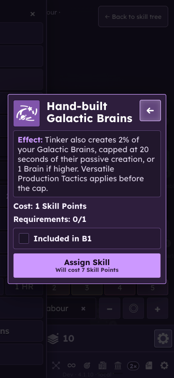
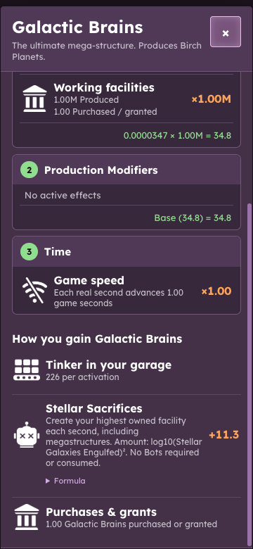
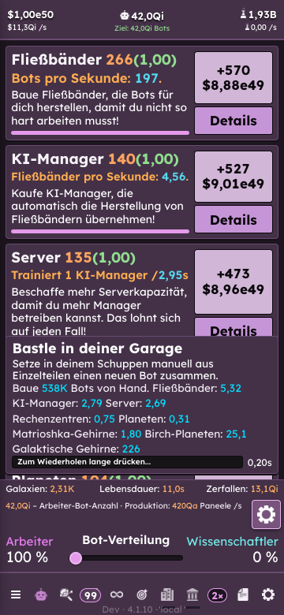

# Manual facility augments — 27 September 2026

## Final behaviour

Hand Assembly preserves ordinary Assembly Line tinkering alongside its Bot
reward. The existing purchased-AI-Manager condition for Assembly Lines remains.
Seven independent, sequential augments add AI Managers, Servers, Data Centers,
Planets, Matrioshka Brains, Birch Planets and Galactic Brains to each activation.
Each costs 1 SP, is refundable, requires Fractured Manual Labour, and requires
the preceding facility augment (the first requires Manual Labour). They do not
require Hand Assembly. Earlier rewards remain available.

The first six additions use the existing Assembly Line formula:
`min(2% of owned units, 20 seconds of incoming facility-chain production)`,
then the existing 1.5× Versatile Production Tactics factor. Megastructure caps
use the combined incoming chain, including the preceding megastructure's output.

Galactic Brains use `min(2% of owned units × Versatile, max(1, 20 × funded
Stellar Sacrifices Brain output per second))`. Funding uses the same continuous
Bot-debit calculation as Stellar Sacrifices. Fractured free sacrifices need no
Bots. Tinker only quotes this production rate: the Tinker grant itself does not
consume Bots. The one-Brain floor applies to the cap, not the reward: one owned
Brain yields 0.02; no owned Brains yields zero.

All grants are generated units, never purchases. Built by Hand and Grounded
restrictions apply. Existing megastructure availability, preset assignment,
refund dependencies, automatic assignment and save/reset ownership rules apply.
Patient Hands stores Bot work only; one activation grants facility rewards once.
No schema change or new saved counter is needed.

Successful Fracturing now opens the skill's augment subtree when one exists.
It unlocks access; it does not assign or purchase the children.

## Presentation and exact changed descriptions

Existing facility/skill artwork is reused. The new path extends left from Manual
Labour at the existing tree spacing, separately from the Bot-work augments.
Tinker lists concurrent rewards compactly. Skill assignment/refund comparisons
and each facility's “How you gain” section use the same per-activation facts;
these are not included in passive per-second production.

- Names: **Hand-built {facility}**.
- AI Managers through Birch Planets: **Tinker also creates 2% of your {facility},
  capped at 20 seconds of their passive creation. Versatile Production
  Tactics applies.**
- Galactic Brains: **Tinker also creates 2% of your Galactic Brains, capped at
  20 seconds of their passive creation, or 1 Brain if higher.
  Versatile Production Tactics applies before the cap.**
- Hand Assembly changes only “Replaces Assembly Line tinkering.” to
  **“Keeps Assembly Line tinkering.”**
- 4.1.10 notes now say **“Added Manual Labour, Swarm and Fragment augments.”**
  rather than retaining the obsolete four-augment count.

All new labels and descriptions are localized in the existing seven translated
catalogs. Existing flavour text is unchanged.

## Verification

- 195 test files / **2,053 tests passed**. TypeScript, lint, generated data,
  localization, first-Dyson parity and production build pass. The build retains
  its existing large-chunk warning.
- Focused coverage includes sequential purchase/refund, presets and save reload,
  challenge restrictions, normal and held rewards, simultaneous Bots/Lines/higher
  facilities, finite bounds, Patient Hands, funded/unfunded/free Stellar caps,
  fractional and zero ownership, shared preview/detail values and fracture
  navigation. First-Dyson baseline changes are four empty facility-yield maps.
- Live isolated Chromium (`--use-mock-keychain`) used disposable saves on port
  5194. The user's port-5193 save was not replaced.
- Fractured Manual Labour through the confirmation controls and verified that
  the subtree opened with children unassigned. Purchased the full seven-node
  chain through the Galactic Brain skill's assignment confirmation.
- Activated Tinker, exercised keyboard-held repeat and inspected concurrent Bot,
  Assembly Line and higher facility output. Reloaded after the normal checkpoint;
  ownership and reward display persisted. Inspected facility details and Escape.
- The live Galactic Brain case had 1 million owned Brains and 11.3/sec Fractured
  Stellar Sacrifices output: both Tinker and the Brain details showed **226 per
  activation**, matching the 20-second cap.
- Visual inspection covered desktop, 360×780 at 130% text, the new branch and skill
  dialog, Assembly Line/Galactic Brain details, and German reward wrapping after
  reload. Screenshots below preserve representative final states.
- Self-review caught and fixed a missing Bot label in the concurrent-reward
  summary when higher facilities exist before the first Manager purchase. The
  preview also shares the canonical Assembly Line eligibility helper.
- No known unresolved defects found in this change. Long-term facility-path
  balance remains a playtesting question. Native iOS/Android, packaged Steam and
  cross-device Cloud interactions were **not rerun**. No deployment or merge.

## Visual evidence

