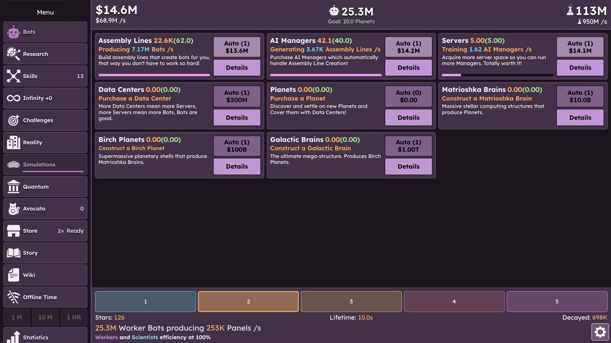
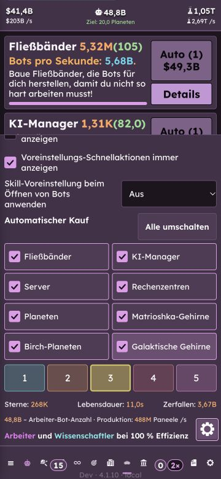

# 4.1.10 achievements and Bots preset shortcuts

Prepared 2026-09-27. Nothing submitted, published or deployed.

| Achievement | Requirement | Points (Apple / Google) | Google ID | Apple ID / Steam API name |
| --- | --- | --- | --- | --- |
| Transcendent | Complete your first Transcendence. | 25 | CgkIkpjJyrENEAIQJg | ids.first_transcendence / FIRST_TRANSCENDENCE |
| Enlightened | Unlock all three Discovery bars. | 25 | CgkIkpjJyrENEAIQJw | ids.enlightenment / ENLIGHTENMENT |
| Challenge Accepted | Complete your first challenge. | 20 | CgkIkpjJyrENEAIQKA | ids.first_quantum_challenge / FIRST_QUANTUM_CHALLENGE |
| Breaking the Rules | Fracture your first skill. | 20 | CgkIkpjJyrENEAIQKQ | ids.first_fracture / FIRST_FRACTURE |
| Galaxy Brain | Own your first Galactic Brain. | 25 | CgkIkpjJyrENEAIQKg | ids.first_galactic_brain / FIRST_GALACTIC_BRAIN |

Against All Odds is intentionally excluded. Requirements are provider-neutral;
existing progress qualifies when still evidenced by the save. Transcendent uses
the actual lifetime reset counter, not the spendable wallet. Fractional generated
facilities count together with purchases only once total ownership reaches one.
Blank Slate, Trial and Error and every Quantum challenge qualify for Challenge
Accepted, including legacy No Science completion. Its original provider identifiers
are retained to preserve the existing draft records and saved achievement evidence.

## Provider state

- Apple: all five records saved as **Prepare for Submission**, non-hidden,
  non-repeatable, English (U.S.) names and both earned/pre-earned descriptions,
  with 512px artwork. 100 Game Center points remain available.
- Google: all five records saved as **Draft / Ready to publish to everyone**;
  revealed, non-incremental, English (U.S.) copy and 512px artwork. Total 865 points.
- Steam: five saved, unpublished client-unlocked records with descriptions and
  separate 256px earned/unearned artwork. All ten saved images reloaded successfully.
- Provider publication/App Review remains a separate release step. Authenticated
  live SDK unlocks have **not** been tested for these new records. No native build
  or internal deployment was made in this change.

[Artwork masters and export procedure](../../../source-assets/achievements/4.1.10/README.md).
[Steam draft evidence](achievement-preset-qa/steam-achievement-drafts.png).
[Apple draft evidence](achievement-preset-qa/apple-achievement-drafts.png).
[Google draft evidence](achievement-preset-qa/google-achievement-drafts.png).

## First-challenge correction

Challenge Accepted now accepts the first completed challenge of either tier. Its
icon uses the actual Challenges tab artwork, replacing the invented target. All
three provider drafts were updated and reloaded to verify saved copy and images;
nothing was published. Focused achievement/mapping coverage passes (45 tests),
along with TypeScript and lint.

[Apple saved localization](achievement-preset-qa/first-challenge-apple.png).
[Google saved icon and description](achievement-preset-qa/first-challenge-google.png).

## Preset shortcuts

Bots now reuses the Skills buttons, conflict dialog, localized skill labels and
selection flow. “Always show preset quick actions” defaults off, is stored on the
device and works independently of the run-facts toggle. Expanded purchase settings
always reveal the shortcuts above the run facts. Challenge/transaction restrictions
and non-refundable assignment acknowledgement still apply.

## Verification

- Final focused run: 13 test files / 117 tests passed. TypeScript, lint, data,
  localization, production build and Electron host checks passed.

- Interactive browser QA on isolated localhost:5194 with disposable progress:
  expanded/collapsed controls, both visibility settings independently, preset
  selection, keyboard Enter, cross-tab selected state, automatic checkpoint and
  reload persistence, and comparison with the Skills buttons.
- Desktop and 360×780 layouts; German at 130% text scale. Expanded controls scroll
  without a visible scrollbar, no horizontal overflow, and all five Bots buttons
  retain 44px targets. Temporary text-scale override was removed by reload.
- Visual QA caught a CSS specificity regression in the extracted Skills buttons;
  fixed and rechecked the original preset colours and compact Skills height.
- Regression coverage includes all achievement rules, false-positive boundaries,
  a real Transcendence reset, native mapping completeness/retained IDs, new evidence
  save/reopen, preview races, retained-conflict confirmation/cancel, failed-preview
  retry, shared non-refundable acknowledgement and independent UI preferences.
- iOS/Android/Steam interaction and authenticated achievement reporting are not
  claimed by this browser QA. Existing native maps are verified against all 32 IDs.

